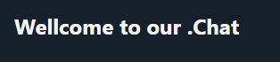

# our Chat


	

## Sobre
our Chat é um web app que permite aos usuários enviar comentários em um feed único, como um fórum online.

A aplicações foi desenvolvida com React, JavaScript e CSS.

1. Praticar alguns conceitos de React como State e Hooks;
2. Praticar CSS, criando uma interface interativa e funcional;

## Como usar
Você pode acessar o projeto aqui: [our Chat ](https://pedrohammes.github.io/comment-feed/)

Também pode executá-lo localmente no seu dispositivo:
1. Faça o clone do repositório
2. Abra o terminal
3. Navegue até a pasta onde o projeto foi clonado
3. Execute o comando abaixo
````
npm run dev
````
4. Clique no link para visualizar o projeto no navegador

## Imagens do projeto
![alt text](image-1.png
